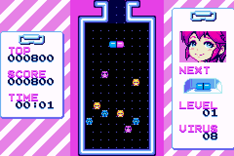
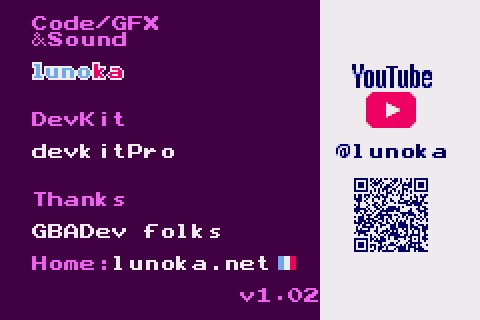

  

<h1 align="center">PopGBA</h1>

  
  

  
  
   
  
  

画面は lunoka 氏の <a href="https://lunoka.itch.io/mai-nurse">「Mai Nurse」</a> を PopGBA の x1(等倍)表示で動かしたものです(作者の許可を得て掲載。下の「クレジット」を参照)。

**非公式の移植版です。** PopGBA は、ゲームボーイアドバンスのエミュレータ [gpSP](https://github.com/libretro/gpsp)(Exophase 氏作、libretro 版)を、SHARP の電子辞書 Brain PW-G5300(Windows CE)向けに移植したものです。gpSP の公式版ではありません。gpSP の作者やメンテナーはこの移植に関わっておらず、サポートもしていません。不具合の報告は、上流ではなくこちらにお願いします。

**Unofficial port.** PopGBA is an unofficial port of the gpSP Game Boy Advance emulator (by Exophase, libretro edition) to the SHARP Brain PW-G5300 electronic dictionary (Windows CE). It is not an official gpSP release, and the gpSP authors and maintainers are not involved in it and do not support it. Please report PopGBA issues here, not upstream.

## ダウンロード
最新版は Releases のページからダウンロードできます。
https://github.com/daizu-coder/PopGBA/releases/latest

## アプリのインストール
Brainへのインストールは[アプリの起動方法](https://brain.fandom.com/ja/wiki/アプリの起動方法)を参照してください。

次の機能には対応していません：振動、通信ケーブル、ワイヤレスアダプタ、傾きセンサー、光センサー(『ボクらの太陽』など)、ジャイロセンサー(『まわる メイドインワリオ』)、カードeリーダー。

## 制作について
コードとマスコットの絵はAI(Claude)で作りました。製作者はプログラムを読めません。

## ライセンスと商標
PopGBA 全体は、上流の gpSP と同じ条件の GNU General Public License バージョン2(GPL-2.0)で配布します。

「ゲームボーイアドバンス」「Game Boy Advance」「Nintendo」「任天堂」は任天堂の商標、「SHARP」「Brain」はシャープ株式会社の商標です。PopGBA は、これらの権利者とは関係ありません。

ライセンスの詳しい説明は [CE/LICENSING.md](../CE/LICENSING.md) にあります。

ゲームの ROM と、ゲームボーイアドバンス本体の BIOS(`gba_bios.bin`)は同梱していません。BIOS を用意しなくても、ゲームは動きます。

## ビルド方法、使用方法
ビルド方法と使用方法は [CE/README.md](../CE/README.md) をご覧ください。

## クレジット

PopGBA は、次の方々の作品を使わせていただいています。ありがとうございます。

- **gpSP**(エミュレータ本体):Exophase 氏。libretro 版は David Guillen Fandos 氏と libretro のコントリビューターが保守しています。GNU GPL バージョン2(GPL-2.0)。上流は [libretro/gpsp](https://github.com/libretro/gpsp) です。
- **オープンソースの GBA BIOS**(`gba_bios.bin` がないときに使う、任天堂の公式 BIOS の代わりとなるもの):Normmatt 氏、VBA / VBA-M 開発チーム。GNU GPL バージョン2(GPL-2.0)。
- **ARM 命令のマクロ**(動的リコンパイラ):Sergey Chaban 氏、Wild West Software。MIT ライセンス。
- **libretro API のヘッダ、libretro-common の一部**:The RetroArch team。MIT ライセンス。
- **東雲フォント(16ドット)**(画面の文字):古川泰之氏ほか、/efont/(電子書体オープンラボ)。実質パブリックドメイン。
- **Galmuri フォント**(画面の文字):Lee Minseo 氏([quiple/galmuri](https://github.com/quiple/galmuri))。SIL Open Font License 1.1。
- **マスコットの絵とアイコン**:AI(Claude)で作りました。CC0 1.0(パブリックドメイン)。
- **スクリーンショットのゲーム**:[「Mai Nurse」](https://lunoka.itch.io/mai-nurse)、作者は lunoka 氏です。作者の許可を得て、この README に掲載しています。スクリーンショットの画像(`.github/screenshots/`)は、このリポジトリのライセンス(GPL-2.0、MIT、CC0 1.0)の対象外で、ゲームの著作権は作者にあります。

それぞれの著作権表示とライセンスの全文は [CE/THIRDPARTY_LICENSES.txt](../CE/THIRDPARTY_LICENSES.txt) にあります。
